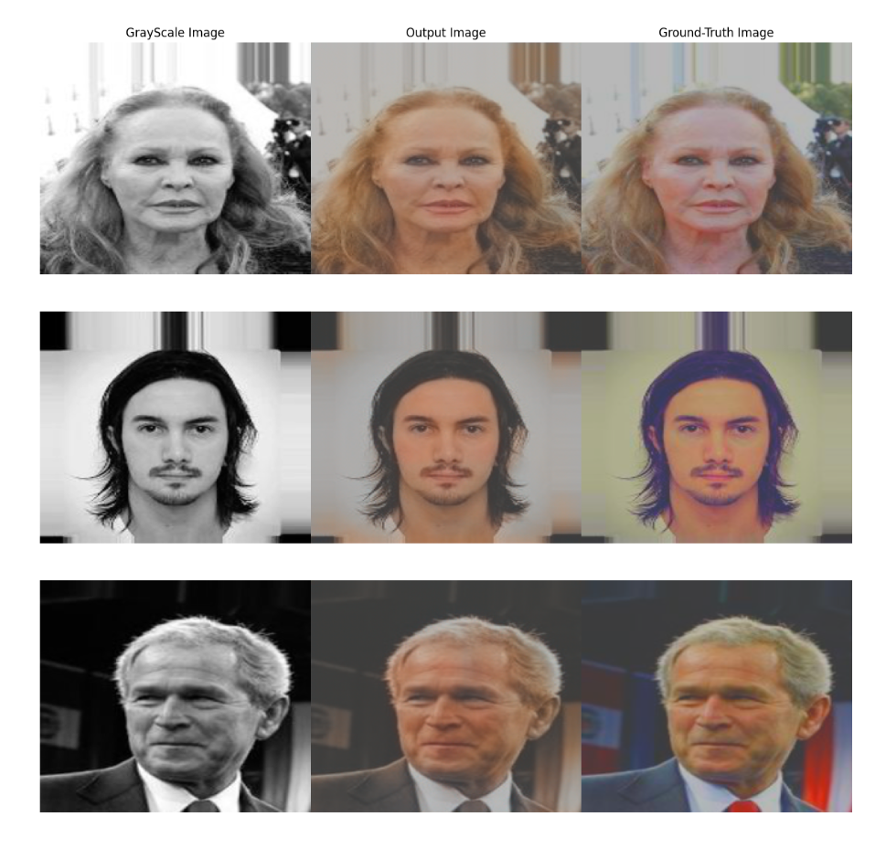

Final project for the 2023 Postgraduate course on Artificial Intelligence with Deep Learning, UPC School, authored by Oriol Jorba, Didac Höflich and Xavier Pareras

Advised by Pol Caselles.

# Table of Contents

1. Introduction and Motivation
1. Datasets
1. The choice of image format
1. Metrics
1.  U-NET
1. The results of U-NET
1. Class imbalance in colorization | Testing an Hypothesis
1. Adding a Perceptual Loss
1. GAN Model
1. GAN Results Comparison
1. Conclusions
1. Next Steps

---
---
## Introduction and Motivation

Colorization is a fascinating area of research in the field of Artificial Intelligence and computer vision that aims to add color to grayscale images automatically. 
By leveraging the power of deep neural networks, colorization models can learn to understand the intricate relationships between the structure of grayscale intensity values and corresponding color spaces. 
The motivation behind colorization has often been to revive historical black-and-white images or recolorize old movies, by applying plausible colors to monochromatic scenes. 

Moreover, colorization has the potential to aid artists, designers, and restoration experts in transforming their creative work. However our main aim is to achive with our limited resources comprehension of diferent architachtures and the effect diferent losses can have on colorization models. 

## Datasets

Our main dataset is CelebA wich is a widely used dataset for research in computer vision and facial recognition. It consists of more than 200,000 celebrity images collected from the internet.
Each image is annotated with 40 attribute labels, providing information about facial characteristics such as age, gender, and presence of accessories like glasses or hats. However for our objective we are only using the images and not the atribute classes or identity.
Celeb A contains images of the size 178×218 however we will downsize them due to computation limitations

As we progressed in our project we found necessary to use another Dataset to test one of our hypothesis wich will be explaind in another chapter.
The dataset we choose was Oxford 102 Flowers for fine-grained image classification and plant recognition tasks. Comprising 8,189 images of 102 different flower species. Often used in plant species identification, image segmentation, and visual recognition.
The images are also annotated with the corresponding flower class label but for this project the labels are not going to be used. 

The Dataset is only used to check anhypothesis and thus is not included in our metrics

## The choice of image format

In our case we want to take the images from our Dataset pass them through our model an obtain a result that is plausible. Our Goal is not to reproduce the ground truth but said plausability. 

However choosing in what format the input is when training the model is not of small importance in colorization problems. Normally images are consumed using RGB with its 3 channels, one for each color (red,blue, Green) . However in its article Colorizing black & white images with U-Net and conditional GAN | Towards Data Science Moein Shariatnia states that in most of the “recent” articles he reviewed (2020) notices the RGB model is discarded. 
And L*a*b model is used instead

Sariatna explains that the problem with training such a model with RGB would be to transform the images from RGB to grayscale and then train the model to predict 3 numbers for each pixel. Instead the literature suggested using the LAB  system. Which already uses a grayscale image that we can use and to rebuild the image and only two other channels. A green-red scale and a blue-yellow scale. Which would make the work of a model substantially easier. 

However taking this format has a series of tradeoffs

### **RGB Format**
  **Advantages**
  - Most Common: RGB is the standard for most images meaning that libraries and many built in functions have this format as its default meaning its simple and straightforward to use. No need to change formats
  - No intrinsic luminosity: This means the model does not need to rely on a luminosity channel as part of its structure its 3 channels build them after they have taken the imput. This forces the model to learn about the structure of the image. 

  **Disadvantages**
  - Harder to predict: having to predict three channels instad of two raises the computational cost as well as the dificulty for the model. 
  -  Perceptual non uniformity: RGB does not conform to the way humans percieve color the Euclidean distance between two colors in the RGB color space does not correspond to their perceived color difference by the human visual system. In other words, a change of the same magnitude in RGB values may result in different perceived changes in color for different regions of the color space.

### **LAB Format**
  **Advantages**
  - Perceptual Uniformity: Conversely to RGB the LAB color space is designed to be perceptually uniform, meaning that the Euclidean distance between colors in the AB channels roughly corresponds to their perceived color difference by the human visual system. In theory this property can lead to more natural and visually appealing colorizations.
  - Reduced complexity: The L channel represents grayscale information, making it unnecessary for the model to predict color for this channel. This simplifies the colorization problem, reducing the complexity of the task and potentially leading to faster convergence during training.

  **Disadvantages**
  - Additional preprocessing: Converting images from RGB to LAB format requires additional preprocessing steps, which may increase the computational overhead during data preparation.
  - Channel dependence: The AB channels' values in LAB format are dependent on the L channel, which means any errors or inaccuracies in the L channel prediction can affect the colorization quality in the AB channels. Moreover the model is not forced to learn the structure of 

We choose LAB format because low computing power and having potentially faster convergence were our main concern.

Similarly to the structure proposed in Influence of Color Spaces for Deep Learning Image Colorization Ballester et al (2022) we feed tha L channel to extract 
predicted ab channels and compare them to the ground truth of the same image according to our criterion. However we do not concatenate them with the L channel or make use of diferentiable RGB function. 

A diagram representing our struture at a high level

## Metrics

**SSIM (Structural Similarity Index):** SSIM is a metric used to quantify the structural similarity between two images. It takes into account the luminance, contrast, and structural patterns present in the images. SSIM compares the local image patches to measure the similarity between them, providing a more perceptually meaningful assessment of image quality compared to pixel-wise metrics like PSNR. In our case to avoid the Luminance input to biase our metrics we compare the chrominance channels. Bear in mind that SSIM will be diferent from other models based on the normalization and scaling applied. 

**PSNR (Peak Signal-to-Noise Ratio):** PSNR is a widely used metric that quantifies the quality of a reconstructed or processed image by measuring the ratio of the peak signal power to the noise power. It calculates the mean squared error (MSE) between our grounf truth image and the output of our model.

## U-NET

As the porpouse of this project was to see the diferences that architechtures and losses have on our output we used a variety of models.

The architecture gets its name from its U-shaped structure, which consists of an encoding path (down-convolution path) and a decoding path (up-convolution path). Let's dive into the details of each part:

Encoding Path:

The encoding path takes the input image and gradually reduces its spatial dimensions while increasing the number of feature channels. It captures high-level abstract representations and context information. The main components of the encoding path are: Down-Convolution: Each down-convolution step consists of a convolutional layer, followed by an activation function such as LeakyReLU, and a normalization layer such as Batch Normalization. These operations help to extract features and introduce non-linearity in the network. Max Pooling: After each down-convolution step, a max pooling operation with a kernel size of 2x2 is performed to reduce the spatial dimensions of the feature maps.

Decoding Path:

The decoding path takes the feature maps from the encoding path and gradually upsamples them back to the original input size while reducing the number of channels. It helps to recover spatial details and refine the segmentation masks. The main components of the decoding path are: Up-Convolution: Each up-convolution step consists of an upsampling operation, often achieved through transposed convolution (also known as deconvolution). This operation increases the spatial dimensions while reducing the number of channels. Concatenation: At each up-convolution step, the feature maps from the corresponding down-convolution step in the encoding path are concatenated with the upsampled feature maps. This skip-connection helps to preserve fine-grained details from the encoding path. Convolution: After concatenation, a regular convolutional layer is applied to refine the combined feature maps. Dropout: In some variations of UNet, dropout layers are introduced to prevent overfitting during training.

Final Layers:

The final layers of the UNet architecture map the refined feature maps to the desired output. Typically, a 1x1 convolution is used to reduce the number of channels to the desired number of output classes (e.g., for semantic segmentation). The activation function used in the final layer depends on the specific task. For example, in binary segmentation, a sigmoid activation is often used, while for multi-class segmentation, a softmax activation is commonly employed. The UNet architecture is symmetric, with the number of channels gradually increasing and then decreasing in the encoding and decoding paths, respectively. This allows the model to capture both local and global information effectively. Additionally, the skip-connections between corresponding layers in the encoding and decoding paths help to bridge the gap between low-level and high-level features, enabling precise segmentation results.

Overall, the UNet architecture has been widely adopted and achieved excellent performance in various image segmentation tasks, making it a popular choice among researchers and practitioners.

The architecture is implemented using two main classes: UnetBlock and Unet.

The UnetBlock class represents a single block in the UNet architecture. Each block consists of a down-convolution path and an up-convolution path. The down-convolution path reduces the spatial dimensions of the input while increasing the number of channels, and the up-convolution path upsamples the feature maps back to the original size while decreasing the number of channels. Each block also performs normalization and activation operations.

The Unet class represents the entire UNet model. It takes a configuration dictionary as input, which specifies the number of input and output channels, the number of down-sampling steps (n_down), and the number of filters to use in each block (num_filters).

The Unet class initializes the model by creating the innermost block first, which only performs up-convolution. Then, for each down-sampling step (except the innermost and outermost blocks), it creates a new UnetBlock instance with dropout and sets it as the submodule of the previous block. This creates a hierarchical structure where each block's submodule is the previous block.

After the down-sampling steps, the model creates three additional blocks for up-convolution. The number of output filters for each up-convolution block is halved compared to the previous block.

Finally, the outermost block is created with the specified output channels and the submodule set as the entire UNet structure. This block represents the final output of the model.

The forward method of the Unet class passes the input through the entire UNet structure and returns the output

### The results of U-NET

It is important to consider that due to the nature of colorization problems raw validation or test metrics musn't be our guiding factor rather other metrics
**L2 Loss**
Introduction to L2 Distance:
The L2 distance, also known as the Euclidean distance or the Euclidean norm, is a measure of similarity or dissimilarity between two points in a multi-dimensional space. It is widely used in various fields, including machine learning, computer vision, and image processing. The L2 distance calculates the straight-line distance between two points by summing the squared differences of their corresponding coordinates and then taking the square root of the result.

Results from epoch 15(left) and epoch 30(right)

 

**L1 Loss**

L1 loss, also known as the mean absolute error (MAE), is less sensitive to outliers compared to L2 loss. It calculates the absolute differences between predicted and ground truth colors, which reduces the influence of extreme values. This robustness can be beneficial in colorization tasks where a few deviating pixels should not significantly affect the overall result. Specially if the quality of images is low and they are not clean.

Results from epoch 15(left) and epoch 30(right)

 

**Smooth L1**

Huber loss, also known as the smooth L1 loss, is a loss function that combines the advantages of L1 and L2 losses. It provides a smooth transition between the two by using L2 loss for small errors and L1 loss for larger errors. The Huber loss function depends on a delta that establishes its sensitivity to large errors or outliers

Results from epoch 15(left) and epoch 30(right)

 

As it can be apreciated from the loss and validation of these trials, in a few epochs the model starts to overfit, The model only needs about 10-15 epochs to achieve its maximum methemathical accuracy to the dataset. This is because of the nature of the losses used the "simplicity of the acrhitecture and possibly to the lack of variety in data

Disadvantages of our losses percieved during training

Disadvantages of our losses percieved during training

Lack of Perceptual Awareness: All three losses treat all color differences equally, regardless of their perceptual impact. In colorization tasks, humans tend to perceive certain color deviations more critically than others. For example, a slight shift in skin tone might be more noticeable than a similar shift in a less salient region. L2 loss does not explicitly consider such perceptual differences, which can lead to less visually appealing colorizations.
While this is in theory partly mitigated by our choice of encoding as Lab has perceptual uniformity with.

Limited Color Distribution: L2 loss focuses on minimizing the Euclidean distance between predicted and ground truth colors. However, this may result in over-smoothed colorizations that lack diversity and fail to capture the complexity of real-world color distributions. L2 loss alone may not effectively encourage the generation of rich and diverse color solutions.

Huber Loss: Dependance on hyperparameters, Huber loss depends on an hyperparameter delta that adjustes its sensitivity to outliers thus to make it worthwile trial and error or hyperparameter tunning would be necessary. This might be why perceptually Huber loss seems to be perhaps less realistic applying a simple sepia filter. 

As 

In practice, a combination of different loss functions and regularization techniques is often employed to address the limitations of individual loss functions. Hybrid loss functions that incorporate both L1 and L2 components, or perceptual loss functions based on pre-trained networks, can provide a good balance between preserving details, capturing perceptual differences, and encouraging smooth and visually coherent colorizations.

## Class imbalance in colorization | Testing an Hypothesis

Class imbalance is a known issue with data that can lead to models overpredicting a class due to being overrepresented in the dataset during training. 
It is normally thought as an issue that mainly concerns classification problems or other types of prediction involving classes. 
However it is also present in colorization and by our choice of Dataset we had inadvertently fallen in it. 
The problem being that our dataset CelebA has images with most of its pixels being celebrity faces. The colour tone of skin is usually uniform or very similar even when when seeing diferent skin colors. Even with darker skin specially because our choice to encode with Lab takesout of the account luminosity. 
This leads to algorithms that "lazily" tend to aply the mean distribution of the color instead 

to test this hypothesis we resolved to use a very diferent dataset to run some training epochs and see if that was the case. In this case we choose the Oxford 102 Flower dataset wich is expleined in the introduction. 

The reasoning behind was the diversity of chrominance and distance those colors have from the center of the continous ab distribution

After training with the Flowers we can easily see how the results are much more saturated and varied. By having a diferent color distribution simply averaging the pixels does not produce a good result forcing the model to learn the structure of the image and predict acording to it more often. 

 

## Adding a Perceptual Loss

**Perceptual Similarity vs Mathemathical Similarity**
When dealing with image generation minimizing the loss functions are not always the more important aspect, because a model that has done a very good job minimizing the loss may have worst results that another model with more plausible results even when the output images might be more diferent from the ground truth. 

This is a comon issue with functions like L2 and metrics like PSNR. Adding a Loss that is capable of improving the results based on human perception might in theory help the results be more realistic and appealing. In the paper The Unreasonable Effectiveness of Deep Features as a Perceptual Metric Zhang et al. (2018)
they two diferent distortions to an image and made humans and diferent models choose wich one ressembled more the orignal. While Most humans agreed on one picture Models like SSIM PSNR or those based on L2 consistently failed to choose thos that humans percieved as more similar.

However some models like many of the pretrained deep Learning models like VGG they consistently chose the image more similar to human perception. This means that using SSIM or PSNR may not necessarily help us choose the most optimal model if compared with a perceptual loss like Zhang proposes. 

When comparing them to the benchmark of human on human agreement whe see that off the shelve models (in Blue) are preety close to the level of other humans. 

After that we resolved to add a perceptual Loss to our model. This however presented some dificulties. As pointed out in Colorful Image Colorization Ballester et al (2022) we have a computing overhead because LPIPS loss has been computed with pre-trained VGG wich is expecting RGB formated inputs.

Our high level architechture would be as follows. The same structure is mantained but after computing the output image each one is joined to RGB and compared to the ground truth using the LPIPS loss of its oficial Library. Wich compares the results of the activations of the network between the GT and the output. This loss is then added to our regular loss by simple sumation weighted by an alpha that can be configured from config. 

Our results were mixed since it did not necessarily improve the results the losses where loss wich is to be expected as the perceptual loss pushes the model in a direction contrary to its most optimal minimization path. And SSIM and PSNR that are slightly lower and thus worst. However Images might perhaps more realistic altough not in any considarable way. 

LPIPS+L2 results

 

the results of L2 loss WITHOUT LPIPS

 

In conlucisons whila images might improve perceptually due to the added computational cost it might not be worth it for our dataset or the U-net Model. 

## GAN Model

**Model/Architecture:**
GANs are generative models that consists in two different networks: the Generator and the Discriminator. The generator is trained to produce outputs that cannot be distinguished from “real” images by an adversarially trained discriminator, which is trained to do as well as possible at detecting the generator’s “fakes”.

We implemented a pix2pix GAN type model for our colorization model. In this image-to-image translation model, we introduce our input images only using the Lightness L channel following the CIELAB color space and we receive as output the a and b channels from the image.
Afterwards we condition our discriminator with the concatenation of both the input and output image. This, in essence, is the same as passing through the output LAB image with the real LAB image.
In the original pix2pix paper the authors used dropout to create some stochasticity and have a variety of outputs for a given input. We didn't implement the GAN as such, and therefore our model is deterministic in nature.

We tried a variety of different parameters during our training. We used two different generators: an Unet and a Resnet. In addition, we have used three different discriminators: A “Critic”, a “Patch Discriminator” and a “Pixel Discriminator”.

The Critic discriminator consists of several convolutional layers that downsample the input images, and on the latest layer we add a fully connected layer. Is important to notice that this discriminator doesn’t have a softmax as we prefer working with the output logits.
The Patch discriminator, or PatchGan, consists on a serie of convolutional layers. It only penalizes structure at the scale of patches. This discriminator tries to classify if each N ×M patch in an image is real or fake. This is advantageous because a smaller PatchGAN has fewer parameters, runs faster, and can be applied to arbitrarily large images. The area of the patch can be very small, and still produce high quality results.
The Pixel Discriminator is a PatchGan of size 1x1, with each convolution having a stride of 1. The prediction is only on pixel level and it works surprisingly well on our case. 

**Note that in our case the generator is not yet functional and we have simply used our regular U-net and tried with a Resnet model taht improves with the help of an adversarial discriminator.**

·Losses:
The main advantage of using GAN over other more traditional approaches is that it learns a loss that adapts to the data, they can be applied to a multitude of tasks that traditionally would require very different kinds of loss functions. We have proven that a distance-based loss function (such as L1, L2, Hubber, etc…) is not well suited for a colorization task, as the output is averaging all the plausible and realistic cases.
In our model, we tried three different losses: “Vanilla”, “LSGAN” and “WGAN-GP”.

**Initial Results**
Using Vanilla Loss, an Unet generator and a Pixel Discriminator we have trained our GAN for 30 epochs. We have used a small dataset of Celebrities faces on our colorization problem. 
The results on the image below show the losses from the discriminator and from the generator. We have split further the discriminator loss between the fake Discriminator loss and the real Discriminator loss. 

 
We can see from the image above that as soon as the Discriminator becomes better, the Generator becomes better also. This is typically the case with a well-designed minimax optimization problem. Additionally, the lack of a proper evaluation metric makes GANs harder to train and know when we should stop. The images below show the different values of the L2 loss, the Peak-To-Noise-Ratio and the Structural Similarity Index our model is likely to be overfit. 

 
   
We believe the cause is that even if our GAN losses are oscillating, the GAN loss has plateaued, while the other losses might become more important. We believe that we should fine-tune the lambda parameter in our model to handle the relative importance of each loss. We might be able to vary the learning rate of our model to reach a different result. 
Additionally, increasing the dataset size will likely not solve the weighting loss problem, but it will likely solve the overfitting part.

**Issues we faced with our GAN Models**

- Mode Collapse
- Dificulty in convergence
- Lack of a GAN apropiate metric

## GAN Results Comparison

**Vanilla GAN**

**WGAN**

**LSGAN**

We Have some results that while aesthethically pleasant give away its a colorization due to unusual color patches in the background. 

## Conclusions

**UNET**

All our three losses by it's own suffer from desaturation. This is in part due to the class imbalance of our Face dominant dataset. 
Using a diferent dataset as we have done with the oxford dataset has improved the desaturation and beige predominance. 
While using a Lpips loss provided perceptually better results the high cost of it and small ammount of improvement made it a tradeoff wich might be better utilized in a more advanced architechture. 

To use Lpips it would be recomendable to use a diferent loss not based on distance but rather on classification pixel per pixel. Thes classification loss when paired with perceptual loss might help improve the result as well as the validation loss. Also using a more apropiate metric might help us evaluate our model ina more fiting way. 

**GAN**
In conclusion, our experience with training GANs for colorization has revealed several important insights. Convergence can be a significant challenge in GAN training, as improvements made to one model often come at the expense of the other. Striking a delicate balance between the generator and discriminator is crucial to promote convergence and achieve stable results.

We have also encountered mode collapse, where the generator tends to produce repetitive or nearly identical outputs. This occurs when the discriminator "learns" that only a limited set of samples can successfully fool it. To address mode collapse, we need to explore architectural modifications, regularization techniques, or increasing the complexity of our models to encourage diversity and realism in the generated colorizations. That was one of ther reasons why we wanted to change to a ResNet

Another crucial aspect we have identified is the lack of a proper evaluation metric. Traditional loss functions like may not capture the perceptual quality or diversity of the generated samples. Hence, we belive the model could benefit from utilizing evaluation metrics such as Frechet Inception Distance (FID) to gain a more comprehensive assessment of our colorization outputs. These metrics will help us select better-performing models that produce visually pleasing and diverse colorizations.

In summary, training GANs for colorization demands careful consideration of convergence, addressing mode collapse, and utilizing appropriate evaluation metrics. By overcoming these challenges, we aim to improve our colorization results and generate diverse, realistic, and visually appealing colorized images.

## Next Steps
Trying Different Losses: In addition to the loss functions mentioned previously (L2, L1, and Huber), we can explore the use of classification loss. Treating colorization as a semantic segmentation problem allows you to leverage the existing labeled color images as training data. By applying a classification loss, the model learns to predict the class labels (color values) for each pixel, which can potentially improve colorization accuracy.

The Loss would be based on the one in Colorful Image Colorization Zhang et al 2016. Treating the problem as multinomial classification. by quantizing the
ab output space into bins with a grid. 

Metrics: In addition to traditional evaluation metrics like L2 or L1 distance, incorporating more advanced metrics can provide a comprehensive assessment of the colorization results. Inception Distance (ID) and Frechet Inception Distance (FID) are two such metrics commonly used in the evaluation of GANs. ID measures the similarity between the generatad color distributions and real color distributions, while FID compares the statistics of feature embeddings extracted from the generated and real color images. These metrics can provide insights into the fidelity and diversity of the generated colorizations. This would not intrinsically lead us to better results but to help choose the best models while helping to Fine tune hyperparameters.

Completing the GAN Model: To enhance the generative capabilities of our model, we should incorporating additional techniques. One approach is to introduce noise into the generative process by using dropout. Dropout can act as a regularizer and encourage the model to explore different colorization possibilities, leading to more diverse and realistic colorizations.

Finishing Residual Blocks (ResNet) on the Generator: Residual blocks, inspired by the ResNet architecture, can be beneficial in deep neural networks. By incorporating residual connections, which allow the network to skip over certain layers,this can alleviate the vanishing gradient problem and facilitate the flow of gradients during training. In our initial trials images seemed to have a higher quality at earlier epochs.

Fine-tuning Hyperparameters: Hyperparameter tuning is an essential step to optimize the performance of our colorization model. Employing appropriate methods, such as grid search, random search, or Bayesian optimization, can help to systematically explore the hyperparameter space and find the optimal settings. Key hyperparameters to consider that we have seen afect most our model include learning rate, batch size, and alphas between LPIPS and other losses. 

Using a Diffusion Model: Diffusion models, such as the Diffusion Probabilistic Model (DPM) or the Continuous Diffusion Model (CDM), provide an alternative framework for generating realistic samples. Diffusion models simulate the iterative process of gradually refining the colorization from an initial noise distribution. Exploring the use of diffusion models in our colorization problem can lead to potentally improved generative approaches. And is showing to provide great results in many types of problems. 